# Used Car Marketplace

Sebuah relational database yang dirancang untuk mendukung website jual beli mobil bekas. Basis data dirancang untuk menyimpan dan mengambil data secara efisien terkait daftar mobil, informasi pengguna, dan aktivitas penawaran.

## Features

1. Setiap user aplikasi dapat menawarkan lebih dari satu produk mobil bekasnya.
2. Sebelum menjual produk mobil, user harus melengkapi data dirinya terlebih dahulu, seperti nama, kontak, dan domisili lokasi.
3. User menawarkan produknya melalui iklan yang akan ditampilkan oleh website.
4. Iklan ini berisikan judul, detail informasi produk yang ditawarkan, serta kontak penjual.
5. Beberapa informasi yang harus ditulis dalam iklan meliputi:
   - Merek mobil: Toyota, Daihatsu, Honda, dll.
   - Model: Toyota Camry, Toyota Corolla Altis, Toyota Vios, Toyota Camry Hybrid, dll.
   - Jenis body mobil: MPV, SUV, Van, Sedan, Hatchback, dll.
   - Tipe mobil: manual atau automatic.
   - Tahun pembuatan mobil: 2005, 2010, 2011, 2020.
   - Deskripsi lain, seperti warna, jarak yang telah ditempuh, dll. Boleh ditambahkan sesuai kebutuhan.
6. Setiap user bisa mencari mobil yang ditawarkan berdasarkan lokasi user penjual, merk mobil, dan jenis body mobil.
7. Jika calon pembeli tertarik terhadap sebuah mobil, ia dapat menawar (bid) harga produk jika penjual mengizinkan fitur tawar.

## Database design

Berikut adalah desain tabel yang digunakan dalam database Used Car Marketplace:

### Tabel `cities`

```
CREATE TABLE cities (
  city_id SERIAL PRIMARY KEY,
  city_name VARCHAR(255) NOT NULL,
  latitude DECIMAL(9, 6) NOT NULL,
  longitude DECIMAL(9, 6) NOT NULL,
  CONSTRAINT uc_latitude_longitude UNIQUE (latitude, longitude)
);
```

Tabel `cities` digunakan untuk menyimpan informasi tentang kota, termasuk ID kota, nama kota, latitude, dan longitude. Constraint `uc_latitude_longitude` digunakan untuk memastikan bahwa kombinasi latitude dan longitude adalah unik.

### Tabel `users`

```
CREATE TABLE users (
  user_id SERIAL PRIMARY KEY,
  name VARCHAR(255) NOT NULL,
  phone_number VARCHAR(20) NOT NULL,
  city_id INTEGER NOT NULL,
  CONSTRAINT fk_city_id FOREIGN KEY (city_id) REFERENCES cities (city_id),
  CONSTRAINT uc_phone_number UNIQUE (phone_number)
);
```

Tabel `users` digunakan untuk menyimpan informasi tentang pengguna aplikasi, termasuk ID pengguna, nama, nomor telepon, dan ID kota tempat tinggal. Constraint `fk_city_id` digunakan sebagai foreign key terhadap tabel `cities` dan constraint `uc_phone_number` memastikan bahwa nomor telepon pengguna adalah unik.

### Tabel `cars`

```
CREATE TABLE cars (
  car_id SERIAL PRIMARY KEY,
  brand VARCHAR(255) NOT NULL,
  model VARCHAR(255) NOT NULL,
  body_type VARCHAR(50) NOT NULL,
  manufacturing_year SMALLINT NOT NULL,
  price_idr DECIMAL(12, 2) NOT NULL,
  CONSTRAINT ck_price CHECK (price_idr >= 0),
  CONSTRAINT ck_manufacturing_year CHECK (manufacturing_year > 0 AND manufacturing_year <= EXTRACT(YEAR FROM CURRENT_DATE))
);
```

Tabel `cars` digunakan untuk menyimpan informasi tentang mobil, termasuk ID mobil, merek, model, jenis body mobil, tahun pembuatan, dan harga dalam Rupiah. Constraint `ck_price` memastikan bahwa harga mobil tidak negatif, dan constraint `ck_manufacturing_year` memastikan bahwa tahun pembuatan mobil valid.

### Tabel `ads`

```
CREATE TABLE ads (
  ad_id SERIAL PRIMARY KEY,
  user_id INTEGER NOT NULL,
  car_id INTEGER NOT NULL,
  title VARCHAR(255) NOT NULL,
  description TEXT NOT NULL,
  mileage_km INTEGER NOT NULL,
  color VARCHAR(50) NOT NULL,
  transmission VARCHAR(50) NOT NULL,
  negotiable BOOLEAN NOT NULL,
  post_date DATE NOT NULL,
  CONSTRAINT fk_user_id FOREIGN KEY (user_id) REFERENCES users (user_id),
  CONSTRAINT fk_car_id FOREIGN KEY (car_id) REFERENCES cars (car_id)
);
```

Tabel `ads` digunakan untuk menyimpan informasi tentang iklan mobil, termasuk ID iklan, ID pengguna, ID mobil, judul iklan, deskripsi, jarak tempuh dalam kilometer, warna, transmisi, negotiable (dapat dinegosiasikan atau tidak), dan tanggal posting. Constraint `fk_user_id` dan `fk_car_id` digunakan sebagai foreign key terhadap tabel `users` dan `cars`.

### Tabel `bids`

```
CREATE TABLE bids (
  bid_id SERIAL PRIMARY KEY,
  user_id INTEGER NOT NULL,
  ad_id INTEGER NOT NULL,
  bid_price_idr DECIMAL(12, 2) NOT NULL,
  bid_date DATE NOT NULL,
  CONSTRAINT fk_user_id FOREIGN KEY (user_id) REFERENCES users (user_id),
  CONSTRAINT fk_ad_id FOREIGN KEY (ad_id) REFERENCES ads (ad_id)
);
```

Tabel `bids` digunakan untuk menyimpan informasi tentang penawaran harga, termasuk ID penawaran, ID pengguna, ID iklan, harga penawaran dalam Rupiah, dan tanggal penawaran. Constraint `fk_user_id` dan `fk_ad_id` digunakan sebagai foreign key terhadap tabel `users` dan `ads`.

## ERD

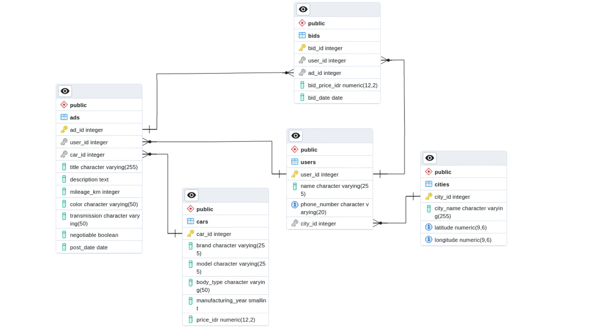

## Membuat dummy data

1. Untuk membuat dummy data, pastikan Anda telah menginstal library Faker sebelum menjalankan kode ini. Jika belum, Anda dapat menginstalnya menggunakan perintah berikut di terminal atau command prompt:

   ```
   pip install faker
   ```

2. Buka terminal atau command prompt.
3. Ubah directory Anda ke folder dummy_data. Misalnya, jika file dummy_data_generator.py berada di dalam folder dummy_data, gunakan perintah berikut:

   ```
   cd dummy_data
   ```

4. Run perintah berikut untuk menjalankan skrip `dummy_data_generator.py`:

   ```
   python dummy_data/dummy_data_generator.py
   ```

5. Anda dapat menyesuaikan jenis dan jumlah data palsu yang ingin dihasilkan dengan memodifikasi kode dalam file `dummy_data_generator.py`.

## Memasukan dummy data ke dalam database

1.  Pastikan Anda telah menginstal library psycopg2 sebelum menjalankan kode ini. Jika belum, Anda dapat menginstalnya menggunakan perintah berikut di terminal atau command prompt:
    ```
    pip install psycopg2
    ```
2.  Buka file credentials_production.py dan isi values koneksi database sesuai dengan konfigurasi database Anda. Pastikan untuk mengisi values berikut:

    ```
    db_host = "hostname"
    db_port = "port"
    db_name = "database_name"
    db_user = "username"
    db_password = "password"
    ```

    Gantilah "hostname", "port", "database_name", "username", dan "password" dengan informasi koneksi database Anda yang valid.

3.  Buka terminal atau command prompt.

4.  Jalankan perintah berikut untuk menjalankan skrip `db_insert.py`:
    ```
    python db_insert.py
    ```
    Skrip akan terhubung ke database menggunakan values koneksi yang ada dalam file `credentials_production.py` dan memasukkan dummy data ke dalam tabel yang ditentukan.

# Retrieve data

## Transactional

### Contoh Case 1

Mencari mobil keluaran 2015 ke atas

```
SELECT *
FROM cars
WHERE manufacturing_year >= 2015;
```

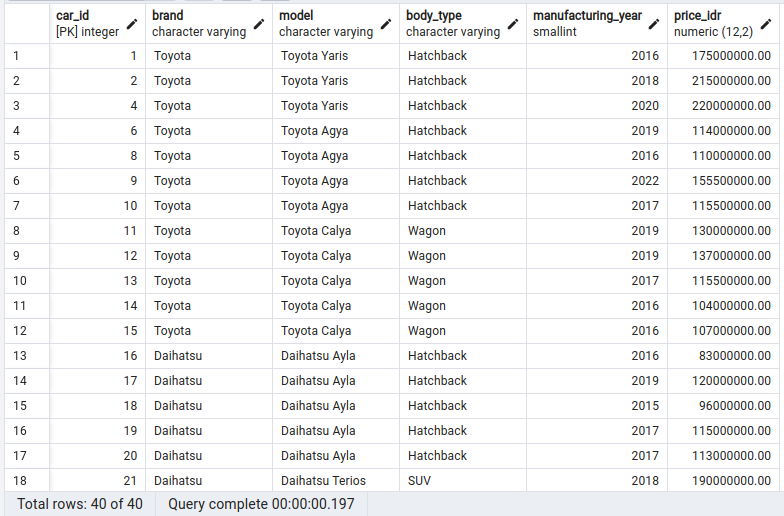

### Contoh Case 2

Menambahkan satu data bid produk baru

```
INSERT INTO bids (user_id, ad_id, bid_price_idr, bid_date)
VALUES (50, 16, 70000000, '2023-02-15')
RETURNING *;
```

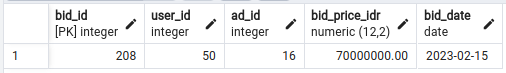

### Contoh Case 3

Melihat semua mobil yg dijual 1 akun dari yang paling baru.

```
SELECT cars.car_id, cars.brand, cars.model, cars.manufacturing_year, cars.price_idr, ads.post_date
FROM cars
LEFT JOIN ads ON cars.car_id = ads.car_id
WHERE ads.user_id = 1
ORDER BY ads.post_date DESC;
```

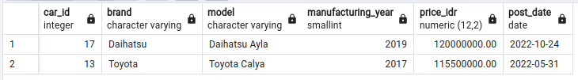

### Contoh Case 4

Mencari mobil bekas yang termurah berdasarkan keyword.

```
SELECT car_id, brand, model, manufacturing_year, price_idr
FROM cars
WHERE model LIKE '%Civic'
ORDER BY price_idr ASC;
```

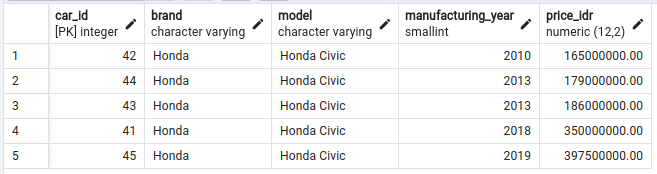

### Contoh Case 5

Mencari mobil bekas yang terdekat berdasarkan sebuah id kota, jarak terdekat dihitung berdasarkan latitude longitude. Perhitungan jarak dapat dihitung menggunakan rumus jarak euclidean berdasarkan latitude dan longitude.

```
SELECT cars.*,
    SQRT(POWER(cities.latitude - target_city.latitude, 2) + POWER(cities.longitude - target_city.longitude, 2)) AS distance,
    cities.city_name
FROM cars
LEFT JOIN ads ON cars.car_id = ads.car_id
LEFT JOIN users ON ads.user_id = users.user_id
LEFT JOIN cities ON users.city_id = cities.city_id
CROSS JOIN (SELECT latitude, longitude FROM cities WHERE city_id = 3171) AS target_city
ORDER BY distance;
```

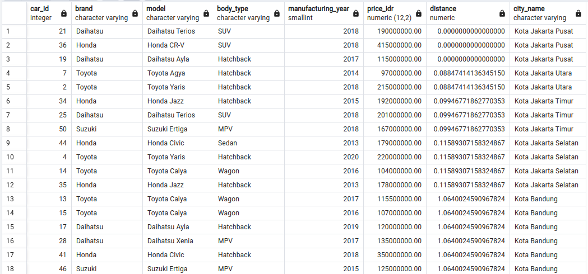

## Analytical

### Contoh Case 1

Ranking popularitas model mobil berdasarkan jumlah bid

```
SELECT cars.model, COUNT(bids.bid_id) AS bid_count
FROM cars
LEFT JOIN ads ON cars.car_id = ads.car_id
LEFT JOIN bids ON ads.ad_id = bids.ad_id
GROUP BY cars.model
ORDER BY bid_count DESC;
```

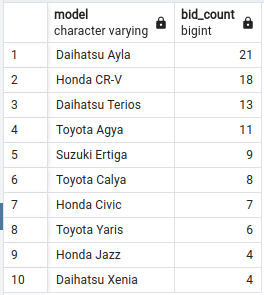

### Contoh Case 2

Membandingkan harga mobil berdasarkan harga rata-rata per kota.

```
SELECT
    cities.city_name,
    cars.brand,
    cars.model,
    cars.manufacturing_year,
    cars.price_idr,
    avg_prices.avg_price AS avg_cars_price_in_the_city
FROM
    cars
JOIN
    ads ON cars.car_id = ads.car_id
JOIN
    users ON ads.user_id = users.user_id
JOIN
    cities ON users.city_id = cities.city_id
JOIN
    (
        SELECT
            cities.city_name,
            AVG(cars.price_idr) AS avg_price
        FROM
            cars
        JOIN
            ads ON cars.car_id = ads.car_id
        JOIN
            users ON ads.user_id = users.user_id
        JOIN
            cities ON users.city_id = cities.city_id
        GROUP BY
            cities.city_name
    ) AS avg_prices ON cities.city_name = avg_prices.city_name
ORDER BY
    cities.city_name;

```

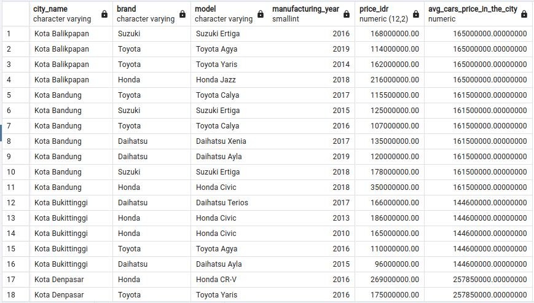

### Contoh Case 3

Dari penawaran suatu model mobil, cari perbandingan tanggal user melakukan bid dengan bid selanjutnya beserta harga tawar yang diberikan

```
WITH ayla_bids AS (
    SELECT
        cars.model,
        bids.user_id,
        bid_date,
        bid_price_idr,
        ROW_NUMBER() OVER (PARTITION BY bids.user_id ORDER BY bid_date) AS bid_rank
    FROM
        cars
    INNER JOIN
        ads ON cars.car_id = ads.ad_id
    INNER JOIN
        bids ON ads.ad_id = bids.ad_id
    WHERE
        cars.model = 'Daihatsu Ayla'
),
next_bids AS (
    SELECT
        model,
        user_id,
        bid_date AS current_bid_date,
        bid_price_idr AS current_bid_price_idr,
        LEAD(bid_date) OVER (PARTITION BY user_id ORDER BY bid_date) AS next_bid_date,
        LEAD(bid_price_idr) OVER (PARTITION BY user_id ORDER BY bid_date) AS next_bid_price_idr
    FROM
        ayla_bids
)
SELECT
    n.model,
    n.user_id,
    n.current_bid_date,
    n.current_bid_price_idr,
    n.next_bid_date,
    n.next_bid_price_idr
FROM
    next_bids n
INNER JOIN
    ayla_bids y ON n.model = y.model AND n.user_id = y.user_id
WHERE
    y.bid_rank = 1
ORDER BY
    n.user_id ASC, n.current_bid_date ASC;
```

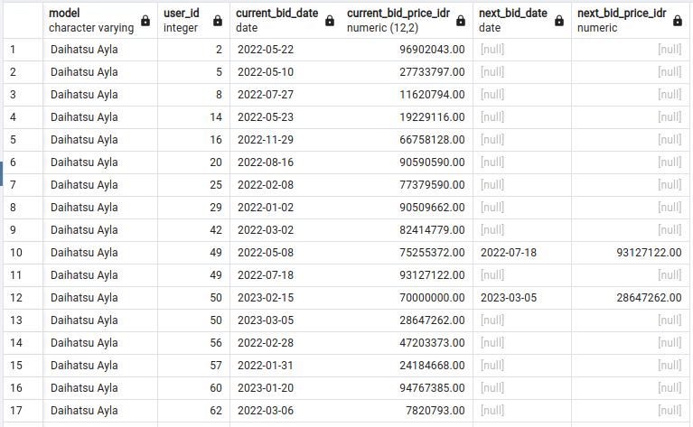

### Contoh Case 4

Membandingkan persentase perbedaan rata-rata harga mobil berdasarkan modelnya dan rata-rata harga bid yang ditawarkan oleh customer pada 6 bulan terakhir

```
WITH model_bid_dates_6m AS (
    SELECT
        cars.model,
        bids.bid_price_idr,
        bids.bid_date
    FROM
        bids
    INNER JOIN
        ads ON bids.ad_id = ads.ad_id
    INNER JOIN
        cars ON ads.car_id = cars.car_id
    WHERE
        bids.bid_date >= NOW() - INTERVAL '6 months'
)
SELECT
    cars.model,
    AVG(cars.price_idr) AS avg_price,
    AVG(model_bid_dates_6m.bid_price_idr) AS avg_bid_6month,
    AVG(cars.price_idr) - AVG(model_bid_dates_6m.bid_price_idr) AS difference,
    (AVG(cars.price_idr) - AVG(model_bid_dates_6m.bid_price_idr)) / AVG(cars.price_idr) * 100 AS difference_percent
FROM
    model_bid_dates_6m
LEFT JOIN
    cars ON model_bid_dates_6m.model = cars.model
GROUP BY
    cars.model;
```

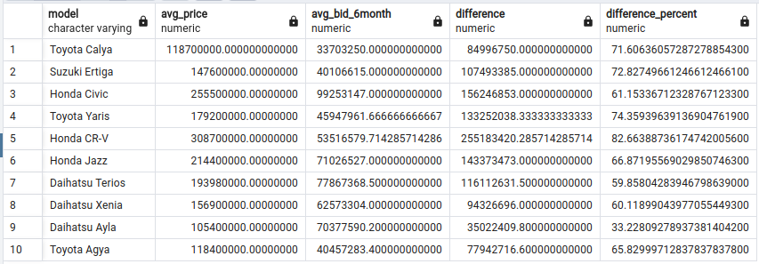

### Contoh Case 5

Membuat window function rata-rata harga bid sebuah merk dan model mobil selama 6 bulan terakhir.

```
    SELECT
        brand,
        model,
        MAX(CASE WHEN rn = 1 THEN bid_price_idr END) AS m_min_6,
        MAX(CASE WHEN rn = 2 THEN bid_price_idr END) AS m_min_5,
        MAX(CASE WHEN rn = 3 THEN bid_price_idr END) AS m_min_4,
        MAX(CASE WHEN rn = 4 THEN bid_price_idr END) AS m_min_3,
        MAX(CASE WHEN rn = 5 THEN bid_price_idr END) AS m_min_2,
        MAX(CASE WHEN rn = 6 THEN bid_price_idr END) AS m_min_1
    FROM (
        SELECT
            brand,
            model,
            bid_price_idr,
            ROW_NUMBER() OVER (PARTITION BY brand, model ORDER BY bid_date DESC) AS rn
        FROM
            bids
        LEFT JOIN
            ads ON bids.ad_id = ads.ad_id
        LEFT JOIN
            cars ON ads.car_id = cars.car_id
        WHERE
            bid_date >= NOW() - INTERVAL '6 months'
    ) AS subquery
    GROUP BY
        brand, model
    ORDER BY
        brand, model;
```

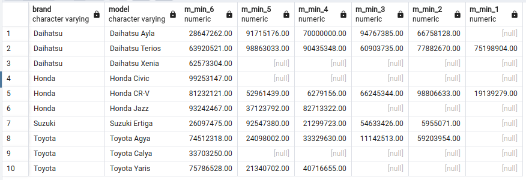
